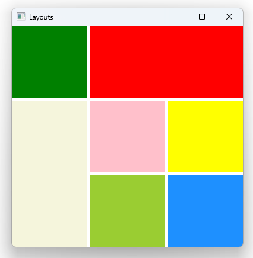

# Notes to self
      . Layout 9 simple rectangles in a GridLayout
            . Show the difference from Grid, by just changing GridLayout to Grid
                . GridLayout tries to adjust to the size of the container when changed.
                . Grid keeps the same size.
                . You can use Layouts if you want this kind of resizing.

        . Change GridLayout to RowLayout
            . You will need to comment out the columns property

        . Show Layout.alignment on topLeftRectId
            . Layout.alignment: Qt.AlignRight

        . Show the fillWidth and fillHeight props :
            .    Layout.fillWidth: true
                Layout.fillHeight: true
            . First apply these to topLeftRectId, show how it tries to occupy
                as much space as possible.
            . Apply the property to all other rectangles to have the thing risize
                reasonably.

        . Show the maximum width and height props on the yellow centerRightRectId :
                . Layout.maximumWidth: 200
                .  Layout.maximumHeight: 150

         . Show row span and column span :
            . topCenterRectId will span two columns
            . centerLeftRectId will span two rows

         . Show Layout direction on GridLayout :
            . layoutDirection: Qt.RightToLeft 
---

# Layouts

---

# Layouts
* RowLayout
* ColumnLayout
* GridLayout

