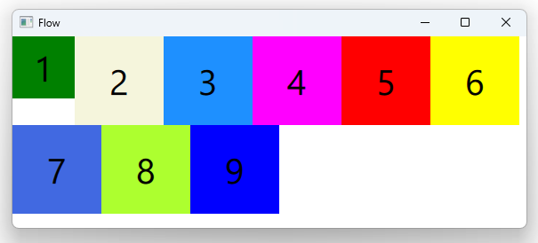

# Notes to self
       . Layout a bunch of rectangles in a flow . One of these :
                    Rectangle {
                        id : topLeftRectId
                        width : 70
                        height: 70
                        color: "green"
                        Text {
                            anchors.centerIn: parent
                            color :"black"
                            font.pointSize: 30
                            text : "1"
                        }
                    }
         . Show that by default these guys are laid out like words on a page,
            when the line fills up, the content wraps to the next line.

         . Show the flow property. Can be :
                . Flow.LeftToRight(default)
                . Flow.TopToButtom
         . Show layoutDirection. Can be :
                . Qt.RightToLeft
                . Qt.LeftToRight(default)
         . Can also combine flow and layout direction :
                .         flow : Flow.TopToBottom
                          layoutDirection: Qt.RightToLeft
         . Show spacing :
            . spacing: 20
---

# Flow


---

```qml
     Flow {
         anchors.fill: parent
         anchors.margins: 4
         spacing: 10

         Text { text: "Text"; font.pixelSize: 40 }
         Text { text: "items"; font.pixelSize: 40 }
         Text { text: "flowing"; font.pixelSize: 40 }
         Text { text: "inside"; font.pixelSize: 40 }
         Text { text: "a"; font.pixelSize: 40 }
         Text { text: "Flow"; font.pixelSize: 40 }
         Text { text: "item"; font.pixelSize: 40 }
     }

```


