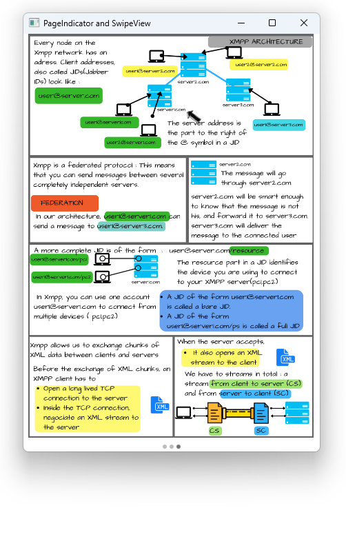

# Notes to self
        . Exploring SwipeView and PageIndicator

            . We use them to allow the user to swipe through pages
            . Use the docs and the Qt5 course to fill in the details.
            . Improvise.
        

---

# RadioButton and CheckBox


---

# SwipeView
```qml
    SwipeView{
        id : swipeViewId
       Image {
           id : image1
           fillMode: Image.PreserveAspectFit
           //source: "https://www.learnqt.guide/images/qt_quick_fundamentals.png"
           source:"qrc:/images/1.png"
       }
       Image {
           id : image2
           fillMode: Image.PreserveAspectFit
           //source: "https://www.learnqt.guide/images/qt_quick_intermediate.png"
           source: "qrc:/images/2.png"
       }
       //...
    }
```

---


# PageIndicator
```qml
    PageIndicator{
        id : pageIndicatorId
        anchors.bottom: parent.bottom
        anchors.horizontalCenter: parent.horizontalCenter

        //Page indicator specific properties
        currentIndex: swipeViewId.currentIndex
        interactive: true
        count : swipeViewId.count
    }
```

---


# All together
```qml
import QtQuick
import QtQuick.Window
import QtQuick.Controls

Window {
    visible: true
    width: 640
    height: 480

    SwipeView{
        id : swipeViewId
        //...
    }
    PageIndicator{
        //...
    }
}
```

---


## CMake
```cmake
find_package(Qt6 6.2 COMPONENTS Quick QuickControls2 REQUIRED)
...
target_link_libraries(app2-Button
    PRIVATE Qt6::Quick Qt6::QuickControls2)

```

