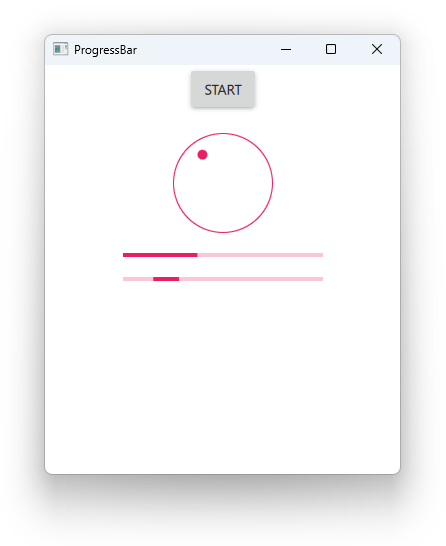

# Notes to self
        . Exploring ProgressbAR
            . The usual thing
            . The styles show up bad on Windows11 by default
                . We try Universal and Material to show how they look on
                    mobile and embedded devices

        . Improvise on the rest
        

---

# ProgressBar


---

# ProgressBar getting values from Dial
```qml
        Dial {
           id : dialId
           from : 1;to : 100
           value : 40
           onValueChanged: {
               progressBarId.value = value
           }
        }

        ProgressBar {
           id : progressBarId
           from : 1;to : 100
           value : 40
        }
```

---


# Indeterminate ProgressBar
```qml
        ProgressBar {
            id : progressBarId1
            indeterminate: true
        }
```

---


## CMake
```cmake
find_package(Qt6 6.2 COMPONENTS Quick QuickControls2 REQUIRED)
...
target_link_libraries(app2-Button
    PRIVATE Qt6::Quick Qt6::QuickControls2)

```

