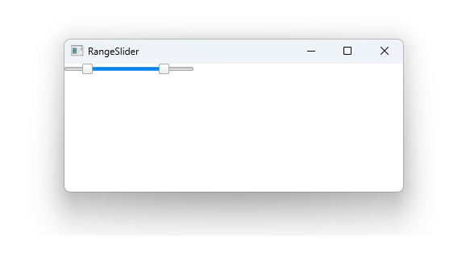

# Notes to self

    . Exploring Range Slider
    . Use the docs and improvise.
        
---

# RangeSlider


---

# RangeSlider
```qml
        RangeSlider{
            //orientation: Qt.Vertical
            from: 1
            to : 100
            first.value: 25
            second.value: 75

            first.onValueChanged: {
                console.log("First value changed to : "+ first.value)
            }
            second.onValueChanged: {
                console.log("Second value changed to :"+ second.value)
            }
        }
```

---


## CMake
```cmake
find_package(Qt6 6.2 COMPONENTS Quick QuickControls2 REQUIRED)
...
target_link_libraries(app2-Button
    PRIVATE Qt6::Quick Qt6::QuickControls2)

```

