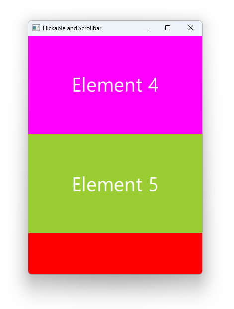

# Notes to self

        . Exploring Flickable and ScrollBar
        . Allows visualize content that is bigger than the available
            screen space.
        . Content can be dragged and moved around.
        . This element forms the basis of Items that are designed to
            show large numbers of child items, such as ListView and GridView
        . Gives the ability to also set up scrollbars if you need them.
        . Use the docs and improvise for the rest.
        
---

# Flickable and ScrollBar


---

# Flickable and ScrollBar
```qml
    Flickable{
        Column{
            id : mColumnId
            Rectangle {
                Text {
                    text: "Element 1"
                }
            }
            Rectangle {}
            Rectangle {}
            Rectangle {}
            //...
        }
        ScrollBar.vertical: ScrollBar{}
    }
```

---


## CMake
```cmake
find_package(Qt6 6.2 COMPONENTS Quick QuickControls2 REQUIRED)
...
target_link_libraries(app2-Button
    PRIVATE Qt6::Quick Qt6::QuickControls2)

```

