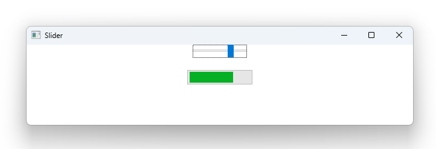

# Notes to self
        Exploring the slider.
        . Same thing as slider
        . May be set this up as an exercise.
        
---

# Slider


---

# Slider
```qml
    Column {
        Slider {
            from : 1; to : 100
            value: 40
            onValueChanged: {
                progressBarId.value = value
            }
        }

        ProgressBar {
            id : progressBarId
            from : 1; to : 100
            value: 40
        }
    }
```

---


## CMake
```cmake
find_package(Qt6 6.2 COMPONENTS Quick QuickControls2 REQUIRED)
...
target_link_libraries(app2-Button
    PRIVATE Qt6::Quick Qt6::QuickControls2)

```

