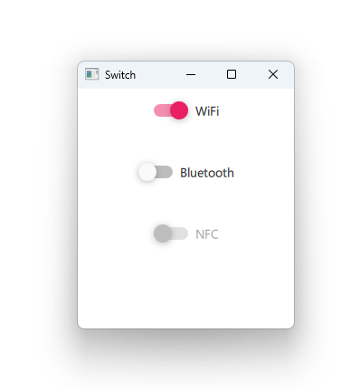

# Notes to self
        . Exploring the Switch control
            . Allows you to turn things on and off
            . Show it in different styles for the best experience.
        
---

# Switch


---

# Switch
```qml
    Column {
        Switch{
            text : "WiFi"; checked: true
            onCheckedChanged: {
                if(checked){
                    console.log("WiFi switch is turned ON")
                }else{
                    console.log("WiFi switch is turned OFF")
                }
            }
        }
        Switch{...}
        Switch{
            text : "NFC"; enabled: false
        }
    }
```

---


## CMake
```cmake
find_package(Qt6 6.2 COMPONENTS Quick QuickControls2 REQUIRED)
...
target_link_libraries(app2-Button
    PRIVATE Qt6::Quick Qt6::QuickControls2)

```

