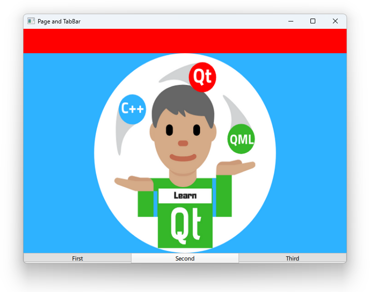

# Notes to self
        . Using Page control together with tabBar
        . Use the doc and improvise
        . Use the Qt5 course as a reference if necessary.
        
---

# Page and TabBar


---

# Page and TabBar
```qml
    Page {
        id : pageId
        header: Rectangle{
            width: parent.width;height: 50;color: "red"
        }

        SwipeView{
            id : swipeViewId
            currentIndex: tabBarId.currentIndex
            Image{
                source: "https://www.learnqt.guide/images/qt_quick_fundamentals.png"
            }
            //...
        }

        footer: TabBar{
            id : tabBarId
            currentIndex: swipeViewId.currentIndex
            TabButton{
                text : "First"
                }
            TabButton{}
        }
    }
```

---


## CMake
```cmake
find_package(Qt6 6.2 COMPONENTS Quick QuickControls2 REQUIRED)
...
target_link_libraries(app2-Button
    PRIVATE Qt6::Quick Qt6::QuickControls2)

```

