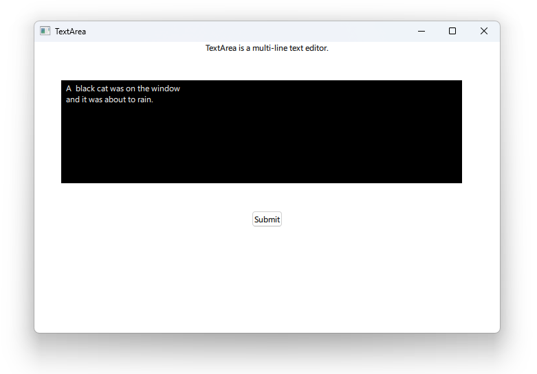

# Notes to self
        . Exploring TextArea
            . Start out with a raw TextArea without a scrollView
            . Wrap in a scrollView to add some scrolling
            . ScrollView has some binding loops problems especially
                when you try to use that in conjunction with TextArea, example
                below :
                    QML ScrollView: Binding loop detected for property "rightPadding"
            . I haven't cared enough to dig more into this, but if it is for your
                project, you may research more on this.LEAVING THIS FOR NOW.
        
---

# Page and TabBar


---

# TextArea and ScrollView
```qml
        ScrollView{
            id : scrollView
            width: 600
            height: 150
            TextArea {
                id : textAreaId
                background: Rectangle{
                    width: parent.width
                    height: parent.height
                    color : "black"
                }
                color: "white"
                wrapMode: TextArea.WordWrap
                placeholderText: "Type in your query"
                //text: "... long text"

            }
        }
```

---


## CMake
```cmake
find_package(Qt6 6.2 COMPONENTS Quick QuickControls2 REQUIRED)
...
target_link_libraries(app2-Button
    PRIVATE Qt6::Quick Qt6::QuickControls2)

```

