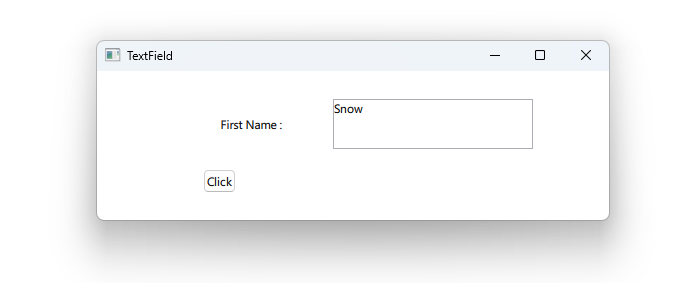

# Notes to self
        . Exploring the TextField and Label Qt Quick Control
            . TextField Allows users to type a single line of text
            . Label just displays the data and has no input capabilities.
            . This is a full control ready to be used with layouts
                This is available in all editors.
            . Use the docs and improvise.
            . Try to summarize on the types of text elements in qml
                    . Text : raw element, like a label, no input capabilities
                    . TextInput : raw element, single line input
                    . TextEdit : raw element, multiple line input

                    . Label : qt quick control, no input capabilities
                    . TextField : qt quick control, single line input
                    . TextArea : qt quick control, multiple line input.
                    . Some good input here : https://forum.qt.io/topic/41348/solved-what-are-the-differences-between-textfield-and-textinput-also-textarea-and-textedit

        
---

# TextField and Label


---

# TextField and Label
```qml
        Row {
            Label {
                wrapMode: Label.Wrap
                horizontalAlignment: Qt.AlignHCenter
                verticalAlignment: Qt.AlignVCenter
                text: "First Name : "
            }
            TextField {
                id : textFieldId
                width: 200
                height: 50
                placeholderText: "Type your First Name"
                onEditingFinished: {
                    console.log("Text Edit Finished : "+ text)
                }
            }
        }
```

---


## CMake
```cmake
find_package(Qt6 6.2 COMPONENTS Quick QuickControls2 REQUIRED)
...
target_link_libraries(app2-Button
    PRIVATE Qt6::Quick Qt6::QuickControls2)

```

