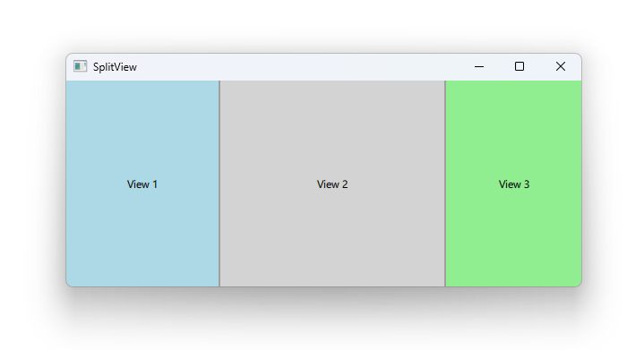

# Notes to self
     . Exploring SplitView
        . This useful only on desktop.
        . May be you can figure out a usecase for mobile and embedded.
        . The code here is different from Qt5. Qt6 here insists on providing
            a preferedwidth. If we don't it defaults to 0 and I don't like that
            as the rectangles are invisible.
        . Improvise    

        
---

# SplitView


---

# SplitView
```qml
    SplitView {
          Rectangle {
              SplitView.preferredWidth: 150
              SplitView.minimumWidth: 100
              color: "lightblue"
              Text {
                  text: "View 1"
                  anchors.centerIn: parent
              }
          }
          Rectangle {...}
          Rectangle {...}
      }
```

---


## CMake
```cmake
find_package(Qt6 6.2 COMPONENTS Quick QuickControls2 REQUIRED)
...
target_link_libraries(app2-Button
    PRIVATE Qt6::Quick Qt6::QuickControls2)

```

