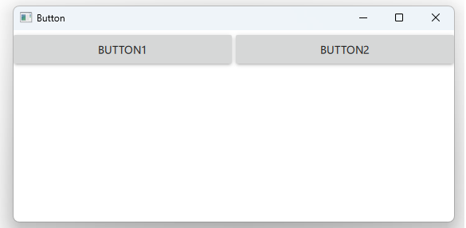

# Notes to self
* Do this and that
    - And that
* Do this and that
* Do this and that
* Do this and that
* Do this and that
* Do this and that

---


---

# QML Button


---

```qml
    RowLayout {
        anchors.left: parent.left
        anchors.right: parent.right

        Button {
            id : button1
            text: "Button1"
            Layout.fillWidth: true
            onClicked: {
                console.log("Clicked on button1")
            }
            onDoubleClicked: {
                console.log("Double clicked on button1")
            }
        }
    }
```

---


## Styles
```c++
    //Load our style
    QQuickStyle::setStyle("Material");
    //QQuickStyle::setStyle("Universal");
    //QQuickStyle::setStyle("Fusion");
    //QQuickStyle::setStyle("Imagine");
    //QQuickStyle::setStyle("Default");
```

---


## CMake
```cmake
find_package(Qt6 6.2 COMPONENTS Quick QuickControls2 REQUIRED)
...
target_link_libraries(app2-Button
    PRIVATE Qt6::Quick Qt6::QuickControls2)

```

