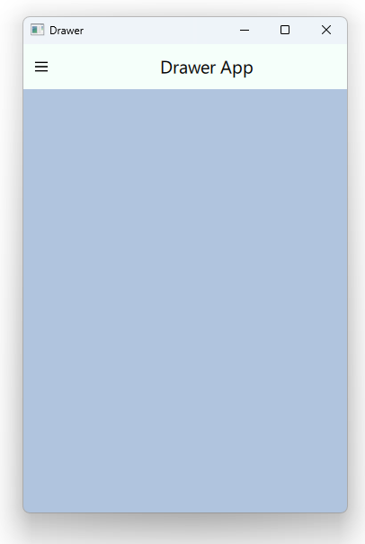
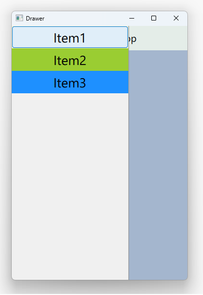

# Notes to self
        . Exploring the drawer component
        . Allows having a menu bar slide in from the left
            like you see on android.
        . Show a visual representation of this in the slides
        . Improvise  

        
---

# Drawer


---


# Drawer


---

# Drawer App Overview
```qml
ApplicationWindow {
    id : rootId
    visible: true
    width: 360
    height: 520
    title: qsTr("Drawer")

    header: ToolBar{}

    Drawer {}

    Rectangle{
        id : contentRectId
        anchors.fill: parent
        color: "gray"
    }
}
```

---


# Toolbar
```qml
    header: ToolBar{
        height: 50
        background: Rectangle{
            color: "mintcream"
        }

        RowLayout {
            spacing: 20
            anchors.fill: parent
            ToolButton{
                background: Rectangle{
                    color: "mintcream"
                }
                icon.source: "qrc:/images/drawer.png"
                onClicked: {
                    console.log("Toolbutton clicked")
                    //Open Drawer
                    drawerId.open()
                }
            }

            Label {
                id: titleLabel
                text: "Drawer App"
                font.pixelSize: 20
                elide: Label.ElideRight
            }
        }
    }
```

---


# Drawer
```qml
     Drawer {
        id : drawerId
        width: Math.min(rootId.width,rootId.height) * (2/3)
        height: rootId.height
        interactive: true
        ColumnLayout{
            Button{
                background: Rectangle{
                    color: "beige"
                }
                Layout.fillWidth: true
                onClicked: {
                    console.log("Clicked on item1 ")
                    contentRectId.color = "red"
                    drawerId.close()
                }
            }
            Button{...}
            Button{...}
        }
    }
```

---


## CMake
```cmake
find_package(Qt6 6.2 COMPONENTS Quick QuickControls2 REQUIRED)
...
target_link_libraries(app2-Button
    PRIVATE Qt6::Quick Qt6::QuickControls2)

```

