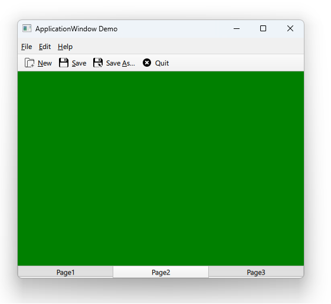

# Notes to self

    . Exploring ApplicationWindow
        . Menus and menu items and actions
        . toolbars and actions
        . main content : stackView
        . footer

    . Note : Note: A pop() operation on a stack with
        depth 1 or 0 does nothing. In such cases, the
        stack can be emptied using the clear() method.

    . This explains why we see a depth of 2 when we change pages.
     . Improvise and refer to the Qt 5 course if necessary.

        
---

# Drawer


---


# A bird's eye view
```qml
ApplicationWindow {
    visible: true
    width: 640
    height: 480

    menuBar: MenuBar {...}
    header: ToolBar {...}
    footer: TabBar {...}

    //Main Content
    StackView {
        id : mStackId
        anchors.fill: parent
        initialItem: Page1{

        }
    }
}
```

---


# Page component
```qml
import QtQuick 2.12
Rectangle {
    color: "red"
} 
```

---


# Menus
```qml
 menuBar: MenuBar {
        Menu {
            title: qsTr("&File")
            Action {
                id : newActionId
                text: qsTr("&New")
                icon.source: "qrc:/images/newFileIcon.png"
                onTriggered: {
                    console.log("Clicked on new")
                }
            }
            Action {...}
            MenuSeparator{}
            Action {...}
        }
        Menu {...}
        Menu {...}
    }
```

---


# ToolBar
```qml
    header: ToolBar {
        Row {
            anchors.fill: parent
            ToolButton{
                action: newActionId
            }
            ToolButton{
                action: saveActionId
            }
            ToolButton{
                action: saveAsActionId
            }
            ToolButton{
                action: quitActionId
            }
        }
    }
```

---


# Footer
```qml
    footer: TabBar {
        id : mTabBar
        width: parent.width

        TabButton {
            text : qsTr("Page1")
            onClicked: {
                mStackId.pop()
                mStackId.push("Page1.qml")
                console.log("Number of items : " + mStackId.depth)
            }
        }
        TabButton {...}
        TabButton {...}
    }
```

---

# NoCode
```qml

```

---


## CMake
```cmake
find_package(Qt6 6.2 COMPONENTS Quick QuickControls2 REQUIRED)
...
target_link_libraries(app2-Button
    PRIVATE Qt6::Quick Qt6::QuickControls2)

```

