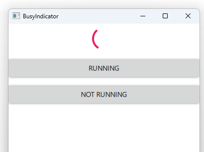

# Notes to self
        . Exploring the BusyIndicator element
        . Show BusyIndicator Bare inside the Window
            . Set running to true and false and run
            . Set visible to true and false and run

        . Add the outer ColumnLayout and the inner ColumnLayout
            containing the buttons
                . Start this out with
                    height: parent.height for the outer ColumnLayout.
                . Add the js to make the buttons show and hide the busyIndicator.

         . Use  Item element below as a spacerItem. Just to show that you can do this

         . Comment out your Item spacer item and just take out the height setting from
            the outer ColumnLayout to achieve the same thing.

         . Play with different styles : [Default,Material,Universal,Imagine,Fusion]
                . Potential bug in Qt : Can't show the BusyIndicator in Imagine Style
                    . Actual error : qrc:/qt-project.org/imports/QtQuick/Controls/Imagine/BusyIndicator.qml:27:18: QML AnimatedImage: Error Reading Animated Image File qrc:/qt-project.org/imports/QtQuick/Controls/Imagine/images/busyindicator-animation.webp

         . Take notes from the Qt5 course where confused.


---

# BusyIndicator


---

```qml
        BusyIndicator{
            id : busyIndicatorId
            running: false
            visible: false

        }
```

---


## CMake
```cmake
find_package(Qt6 6.2 COMPONENTS Quick QuickControls2 REQUIRED)
...
target_link_libraries(app2-Button
    PRIVATE Qt6::Quick Qt6::QuickControls2)

```

