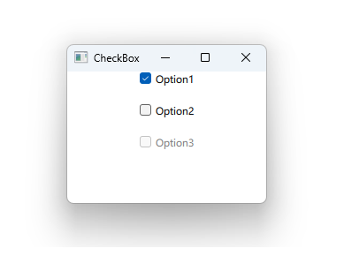

# Notes to self
    . Exploring CheckBox
    . Giving the user exclusive choices
    . Start by going through the docs
    . Improvise on this as it has become second nature to you.

---

# CheckBox


---

```qml
Column {
        spacing: 20
        anchors.horizontalCenter: parent.horizontalCenter

        CheckBox {
            text : "Option1"
            checked: true
            onCheckStateChanged: {
                if (checked)
                {
                    console.log("Option1 is checked")
                }else{
                    console.log("Option1 is unchecked")
                }
            }
        }
        CheckBox {
            text : "Option2"
        }
        CheckBox {
            text : "Option3"
            checked: false
            enabled: false
        }
    }
```

---


## CMake
```cmake
find_package(Qt6 6.2 COMPONENTS Quick QuickControls2 REQUIRED)
...
target_link_libraries(app2-Button
    PRIVATE Qt6::Quick Qt6::QuickControls2)

```

