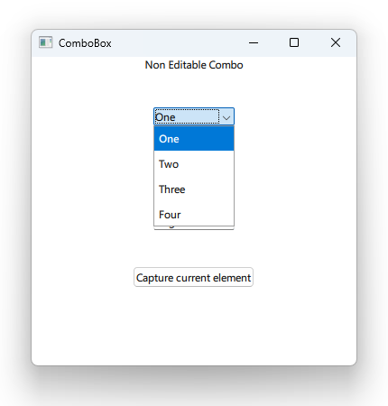

# Notes to self
        . Exploring ComboBox
        . Non Editable Combobox
            . Just feed the model property
            . Know when an item is activated
        . Editable combobox : We want to add items dynamically at run time
            . We add new data when the item is accepted.(Return pressed)

        . If confused, refer to the Qt 5 course for clarity.

---

# ComboBox


---

# Non Editable ComboBox
```qml
        Label {
            text: "Non Editable Combo"
            wrapMode: Label.Wrap
            horizontalAlignment: Qt.AlignHCenter
            width: parent.width
        }

        ComboBox {
            id : nonEditableComboId
            model: ["One","Two","Three","Four"]
            anchors.horizontalCenter: parent.horizontalCenter
            onActivated: {
                console.log("[" + currentIndex +"]" + currentText + " is activated")
            }

        }
```

---


# Editable ComboBox
```qml
    ComboBox {
        id : editableComboId
        editable: true
        textRole : "text"
        model: ListModel {
                id : model
                ListElement { text: "Dog";location:"Kigali" }
                ListElement { text: "Chicken";location : "Beijing" }
        }
        onActivated: {
            console.log("[" + currentIndex +"]" + currentText + " is activated")
        }
        onAccepted: {
            if ( find(editText) === -1){
                    model.append({text : editText , location : "US"})
            }
        }
    }
```

---


## CMake
```cmake
find_package(Qt6 6.2 COMPONENTS Quick QuickControls2 REQUIRED)
...
target_link_libraries(app2-Button
    PRIVATE Qt6::Quick Qt6::QuickControls2)

```

