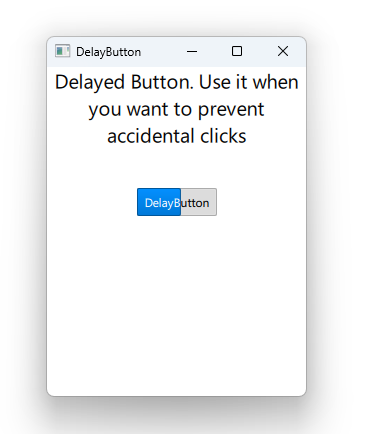

# Notes to self
        . Exploring DelayButton
            . Used to delay activation of a button
            . Once the delay runs out , the button is activated
            . The button doesn't process clicks until it is activated
            . We can track the activation progress.

        . Refer to the Qt 5 course when confused.
        

---

# DelayButton


---

# DelayButton
```qml
        DelayButton {
            property bool activated: false
            text: "DelayButton"
            anchors.horizontalCenter: parent.horizontalCenter
            delay: 1000

            onPressed: {
                if(activated === true)
                {
                    console.log("Button is Clicked")
                    activated = false;
                }
            }
            onActivated: {
                console.log("Button Activated")
                activated = true
            }
            onProgressChanged:{
                console.log(progress)
            }
        }
```

---


## CMake
```cmake
find_package(Qt6 6.2 COMPONENTS Quick QuickControls2 REQUIRED)
...
target_link_libraries(app2-Button
    PRIVATE Qt6::Quick Qt6::QuickControls2)

```

