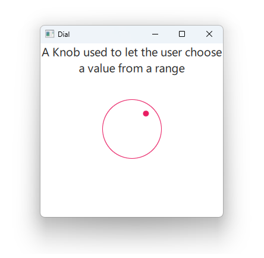

# Notes to self
    . Exploring the Dial control
    . Show the wrap property.
        

---

# Dial


---

# DelayButton
```qml
        Dial{
            anchors.horizontalCenter: parent.horizontalCenter
            from: 1
            to : 100
            value: 50
            //wrap: true

            onValueChanged: {
                console.log(" Current value : " + Math.ceil(value))
            }

        }
```

---


## CMake
```cmake
find_package(Qt6 6.2 COMPONENTS Quick QuickControls2 REQUIRED)
...
target_link_libraries(app2-Button
    PRIVATE Qt6::Quick Qt6::QuickControls2)

```

