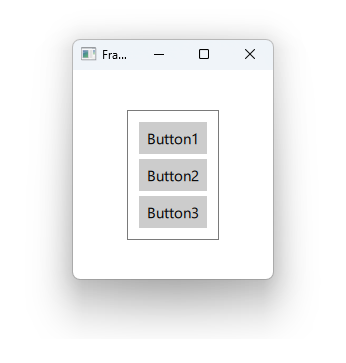

# Notes to self
        . Exploring Frame
            . Gives us a logical grouping of elements
            . Doesn't give us any layout. You have to provide your own
                positioning.

         . Looks bad by default on Windows11, so we change the style to
            show different looks.
        

---

# Frame


---

# DelayButton
```qml
    Frame {
        anchors.centerIn: parent

        ColumnLayout {
            Button {
                text: "Button1"
            }
            Button {
                text: "Button2"
            }
            Button {
                text: "Button3"
            }
        }
    }
```

---


## CMake
```cmake
find_package(Qt6 6.2 COMPONENTS Quick QuickControls2 REQUIRED)
...
target_link_libraries(app2-Button
    PRIVATE Qt6::Quick Qt6::QuickControls2)

```

