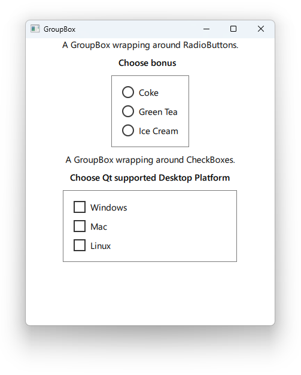

# Notes to self
        . Using GroupBox to wrap around RadioButton and CheckBox
        . Knowing when the checked state of a button changes
        . The rest is intuitional
        

---

# RadioButton and CheckBox


---

# RadioButton
```qml
        GroupBox{
            title: "Choose bonus"
            Column{

                RadioButton{
                    text : "Coke"
                    onCheckedChanged: {
                        if( checked){
                            console.log("Coke button checked")
                        }else{
                            console.log("Coke button is NOT checked")
                        }
                    }
                }
                RadioButton{
                    text : "Green Tea"
                }
                RadioButton{
                    text : "Ice Cream"
                }
            }
        }
```

---


# CheckBox
```qml
        GroupBox{
            title: "Choose Qt supported Desktop Platform"
            Column{
                CheckBox{
                    text : "Windows"
                    onCheckedChanged: {
                        if( checked){
                            console.log("Windows button checked")
                        }else{
                            console.log("Windows button is NOT checked")
                        }
                    }
                }
                CheckBox{
                    text : "Mac"
                }
                CheckBox{
                    text : "Linux"
                }
            }
        }
```

---


## CMake
```cmake
find_package(Qt6 6.2 COMPONENTS Quick QuickControls2 REQUIRED)
...
target_link_libraries(app2-Button
    PRIVATE Qt6::Quick Qt6::QuickControls2)

```

