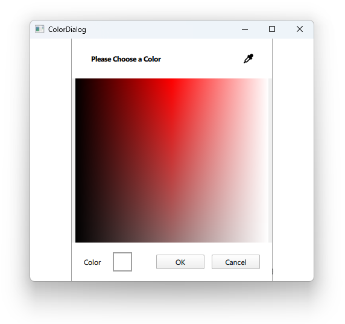

# Notes to self
    .   Exploring colorDialog
    . Just make sure you use the documentation for QtQuick.Dialogs
        
---

# ColorDialog


---

# ColorDialog
```qml
  Column {
        Button{
            text : "Choose Color"
            onClicked: {
                colorDialogId.open()
            }
        }
        Rectangle{
            id : rectangleId
        }
        ColorDialog{
            id : colorDialogId
            title: "Please Choose a Color"
            onAccepted: {
                rectangleId.color = selectedColor
            }
            onRejected: {
                console.log("User rejected dialog")
            }
        }
    }
```

---


## CMake
```cmake
find_package(Qt6 6.2 COMPONENTS Quick QuickControls2 REQUIRED)
...
target_link_libraries(app2-Button
    PRIVATE Qt6::Quick Qt6::QuickControls2)

```

