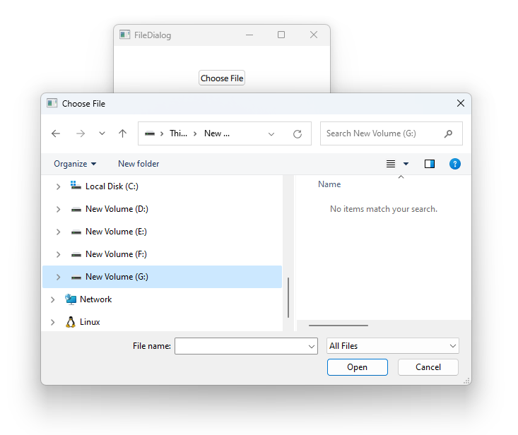

# Notes to self
        . Exploring FileDialog
            . The docs
            . The API has changed from Qt5 to Qt 6
            . You get the selected file  by going through the selectedFile property.
            . Use the doc and improvise.

            . Availability : A native platform file dialog is currently
                    available on the following platforms:
                       .  iOS
                       .  Android
                       .  Linux (when running with the GTK+ platform theme)
                       .  macOS
                       .  Windows

            . Mention filters
        
---

# FileDialog


---

# FileDialog
```qml
    Column {
        Button{
            text : "Choose File"
            onClicked: {
                fileDialogId.open()
            }
        }
        Text {
            id : textId
            text : "Use hasn't chosen yet"
        }
        FileDialog{
            id : fileDialogId
            title: "Choose File"
            onAccepted: {
                textId.text = selectedFile
            }
            onRejected: {
                textId.text = "Dialog rejected"
            }
        }
    }
```

---


## CMake
```cmake
find_package(Qt6 6.2 COMPONENTS Quick QuickControls2 REQUIRED)
...
target_link_libraries(app2-Button
    PRIVATE Qt6::Quick Qt6::QuickControls2)

```

