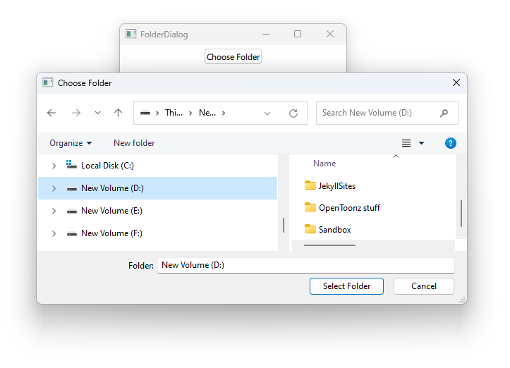

# Notes to self
        . Used to select folders
        . Use the doc and improvise

        
---

# FolderDialog


---

# FolderDialog
```qml
    Column {
        Button{
            onClicked: {
                folderDialogId.open()
            }
        }
        Text {
            id : textId
            text : "Use hasn't chosen yet"
        }

        FolderDialog{
            id : folderDialogId
            onAccepted: {
                textId.text = selectedFolder
            }
            onRejected: {
                textId.text = "Dialog rejected"
            }
        }
    }
```

---


## CMake
```cmake
find_package(Qt6 6.2 COMPONENTS Quick QuickControls2 REQUIRED)
...
target_link_libraries(app2-Button
    PRIVATE Qt6::Quick Qt6::QuickControls2)

```

