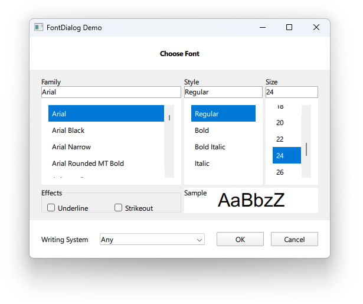

# Notes to self

        . Exploring fontDialog
        . Used to select fonts
        . Use the doc and improvise based on the code here


        
---

# FontDialog


---

# FontDialog
```qml
    Column {
        Button{
            onClicked: {
                fontDialogId.open()
            }
        }
        Text {
            id : textId
            text : "Hello World"
        }
        FontDialog{
            id : fontDialogId
            currentFont : Qt.font({ family: "Arial", pointSize: 24, weight: Font.Normal })
            onAccepted: {
                textId.font = fontDialogId.selectedFont
            }
            onRejected: {
                console.log("Dialog rejected")
            }
        }
    }

```

---


## CMake
```cmake
find_package(Qt6 6.2 COMPONENTS Quick QuickControls2 REQUIRED)
...
target_link_libraries(app2-Button
    PRIVATE Qt6::Quick Qt6::QuickControls2)

```

