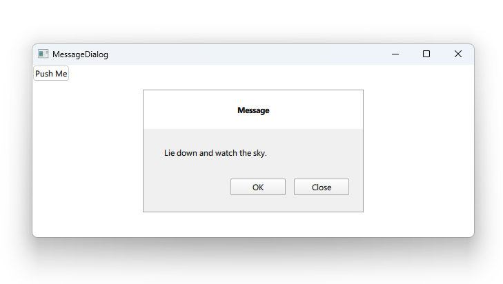

# Notes to self
        . Exploring MessageDialog
        . Allow to show prompt messages to users
        . Use the doc and improvise.
     
---

# MessageDialog


---

# MessageDialog
```qml
    Button{
        onClicked: {
            messageDialog.open()
        }
    }
    MessageDialog {
        id: messageDialog
        title: "Message"
        text: "Lie down and watch the sky."
        buttons: MessageDialog.Ok | MessageDialog.Close
        onAccepted: {
            console.log("Dialog accepted.")

        }
        onRejected: {
            console.log("Dialog rejected")
        }
    }
```

---


## CMake
```cmake
find_package(Qt6 6.2 COMPONENTS Quick QuickControls2 REQUIRED)
...
target_link_libraries(app2-Button
    PRIVATE Qt6::Quick Qt6::QuickControls2)

```

