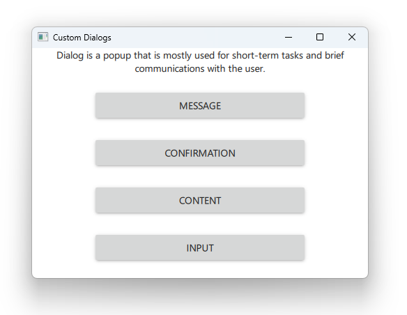
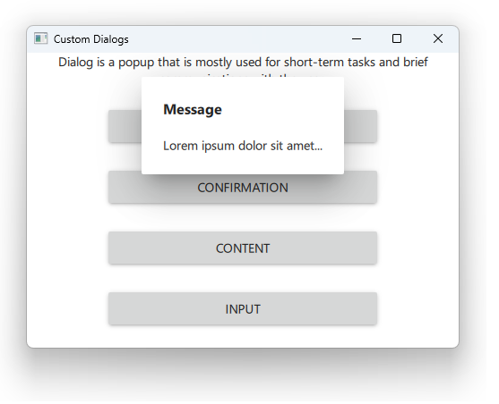
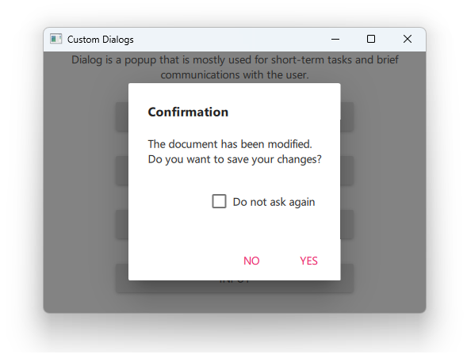
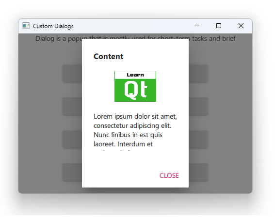
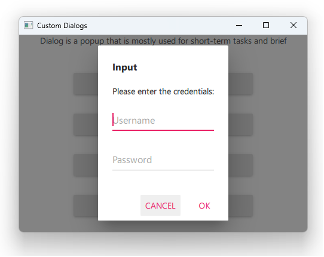

# Notes to self
        . Showing some custom dialogs you can use even on mobile
        . Start by running the gallery example and show the dialogs
            . just like in the Qt 5 course
        . From there, create a project and steal the code for the
            custom dialogs and learn from them

        . Change the contentHeight property in the Button for content
                to not cause binding loops by making it depend on the parent height.

        . The goal here is to help students steal things from Qt examples.

        . Use the info above as a base and improvise.
     
---

# Custom Dialogs


---

# Message


---

# Confirmation


---

# Content


---

# Input



---

# Using the Qt Examples
* There are tons of examples from the Qt project you can learn from
* We'll learn from the Gallery example and build all these cool dialogs

---


## CMake
```cmake
find_package(Qt6 6.2 COMPONENTS Quick QuickControls2 REQUIRED)
...
target_link_libraries(app2-Button
    PRIVATE Qt6::Quick Qt6::QuickControls2)

```

